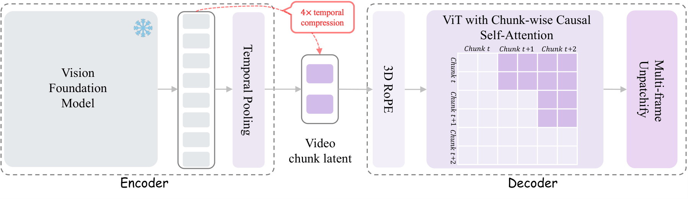
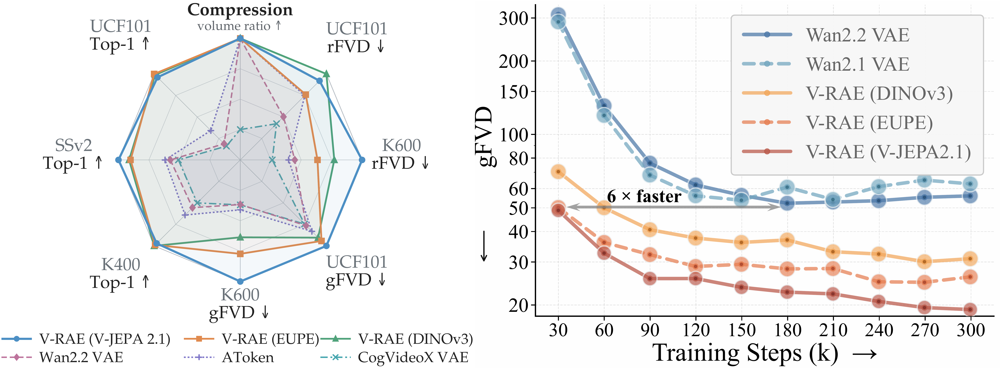
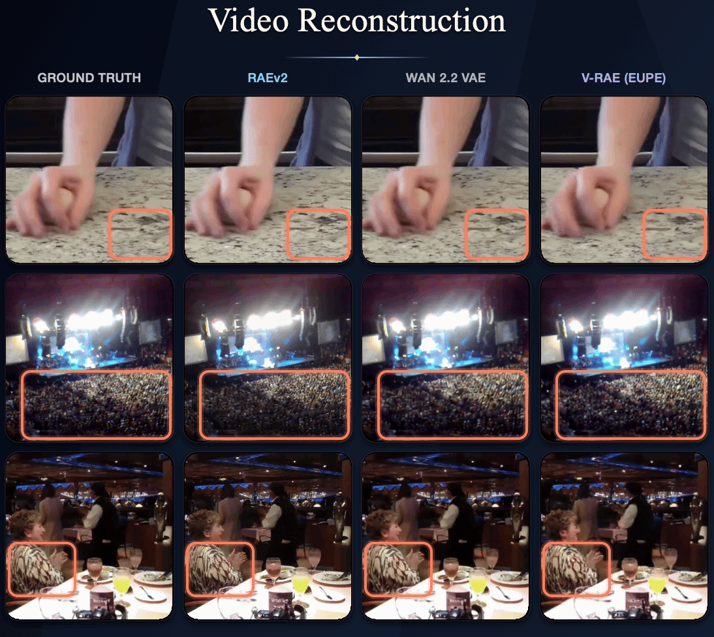
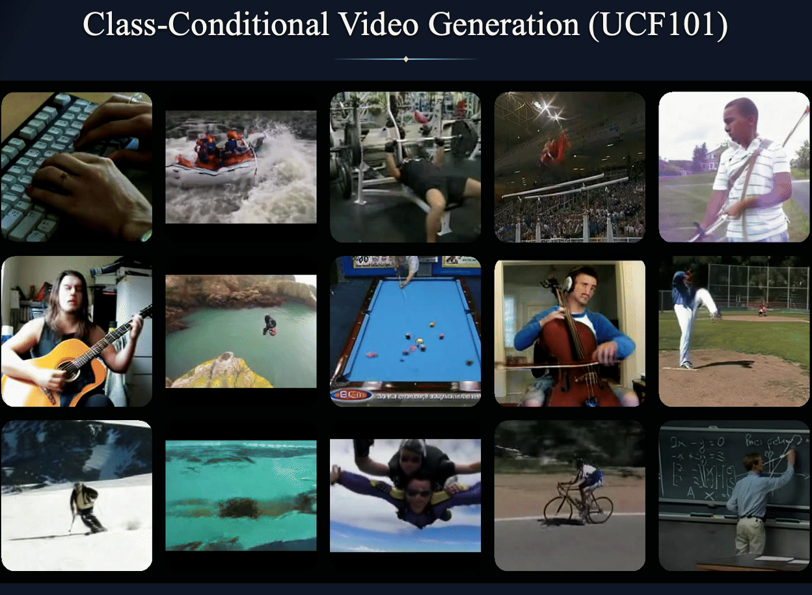
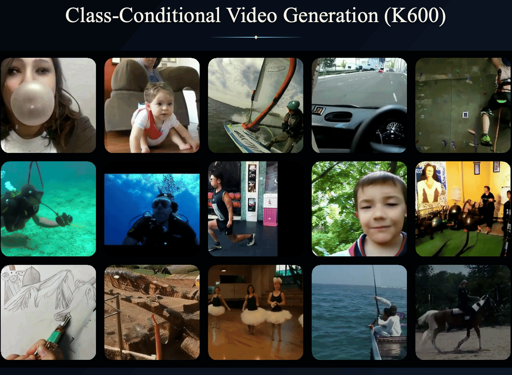
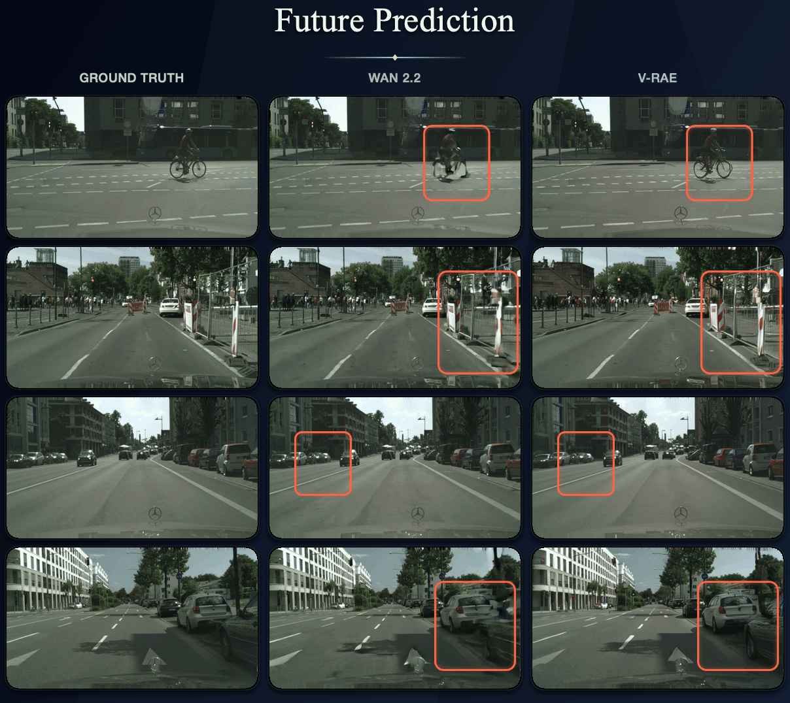

<div align="center">
<h1>V-RAE: Rethinking Video Latent Spaces for Generation</h1>
<p>
  <a href="https://guominghui07.github.io/">Minghui Guo</a><sup>1</sup> &nbsp;&nbsp; <a href="https://sqwu.top/">Shengqiong Wu</a><sup>2</sup> &nbsp;&nbsp; <a href="https://haofei.vip/">Hao Fei</a><sup>2</sup>
</p>
<p>
  <sup>1</sup>National University of Singapore &nbsp;&nbsp; <sup>2</sup>University of Oxford
</p>
</div>

<!-- **Official PyTorch Implementation** -->

<p align="center">
  <a href="https://arxiv.org/abs/2608.13556"></a>
  <a href="https://v-rae.github.io/"></a>
  <a href="https://huggingface.co/Guomh0707/V-RAE-Models"></a>
</p>


V-RAE is a video representation autoencoder that builds compact generative latents on top of frozen vision foundation model representations. A lightweight temporal pooling module removes temporal redundancy while preserving semantic structure, and a video decoder reconstructs continuous motion from the compressed features.



We evaluate V-RAE with four representative frozen encoders (e.g., `DINOv3`, `SigLIP2`, `V-JEPA2.1`, and `EUPE`) on video reconstruction, semantic probing, and class-conditional generation:
- V-RAE achieves **2.13 rFVD** on K600, outperforming all evaluated large-scale pretrained video VAEs
- V-RAE achieves **117.86** and **19.16** gFVD on UCF101 and K600, respectively, while
converging up to **6× faster**.
- **tFVD** increases the high Pearson correlations to 𝑟 = 0.621 on UCF101 and 𝑟 = 0.919 on K600, respectively, comparing to rFVD.
- Semantic latents yielded from V-RAE form a directly decodable predictive state space.

## Visual Results

The examples below follow the same progression as our evaluation: from faithful video reconstruction, to class-conditional generation, and finally to future prediction in the learned latent space.

### Video Reconstruction

V-RAE preserves fine spatial detail and coherent motion while operating on compact semantic latents.

<p align="center">
  <a href="assets/video-reconstruction-comparison.gif">
    
  </a>
</p>

### Class-Conditional Video Generation

The same latent space supports diverse class-conditional generation on both UCF101 and Kinetics-600.

<p align="center">
  <a href="assets/class-conditional-video-generation-ucf101.gif">
    
  </a>
</p>

<p align="center">
  <a href="assets/class-conditional-video-generation-k600.gif">
    
  </a>
</p>

### Future Prediction

Beyond reconstruction and generation, V-RAE provides a directly decodable state space for forecasting future video frames.

<p align="center">
  <a href="assets/world-model-future-prediction.gif">
    
  </a>
</p>

## Repository Layout

```text
V-RAE/
├── src/vrae/              # Installable models, training code, and evaluation code
├── configs/
│   ├── models/            # Shared V-RAE and VideoDiT model definitions
│   ├── training/          # Reconstruction and generation recipes
│   └── evaluation/        # UCF101, Kinetics-600, and Cityscapes protocols
├── scripts/
│   ├── train/             # Distributed training launchers
│   └── eval/              # Distributed evaluation launchers
├── sampling.py            # Reconstruction examples
└── third_party/           # Required upstream encoder implementations
```

## Installation

The released training and evaluation recipes are intended for Linux systems with NVIDIA GPUs. Before installation, make sure the machine has a CUDA-compatible driver and FFmpeg available; FFmpeg is required by TorchCodec for video decoding. Python 3.10 or later is required.

```bash
git clone https://github.com/V-RAE/V-RAE.git
cd V-RAE

conda create -n vrae python=3.10 -y
conda activate vrae
conda install -c conda-forge ffmpeg -y

pip install uv
uv pip install -e .
```

This installs the pinned PyTorch, TorchVision, TorchCodec, Transformers, and other runtime dependencies declared in `pyproject.toml`. Verify that PyTorch can access CUDA and that TorchCodec can load its video decoder:

```bash
python -c "import torch; from torchcodec.decoders import VideoDecoder; import vrae; print(f'V-RAE {vrae.__version__} | PyTorch {torch.__version__} | CUDA {torch.version.cuda} | GPU available: {torch.cuda.is_available()}')"
```

## 1. Inference

### 1.1 Download V-RAE Weights

V-RAE and generation model checkpoints are available from [V-RAE-Models](https://huggingface.co/Guomh0707/V-RAE-Models). Download the complete repository into the expected local layout:

```bash
hf download Guomh0707/V-RAE-Models --local-dir ckpts
```

### 1.2 Run the Code

Place three video samples at:

```text
assets/sample1.mp4
assets/sample2.mp4
assets/sample3.mp4
```

Run reconstruction with one of the following variants:

```bash
python sampling.py dino
python sampling.py siglip
python sampling.py vjepa
python sampling.py eupe
```

Results are saved to:

```text
outputs/<variant>/sample1-comparison.mp4
outputs/<variant>/sample2-comparison.mp4
outputs/<variant>/sample3-comparison.mp4
```

## 2. Data and Encoder Weights Preparation

### 2.1 Data Downloading

Download only the datasets needed for training and evaluation:

| Dataset | Used for |
| --- | --- |
| [UCF101](https://huggingface.co/datasets/quchenyuan/UCF101-ZIP/tree/04d4e5ca1dc93606cb58752b0c08331e598743a4) | Reconstruction and UCF101 class-conditional generation |
| [Kinetics-600](https://opendatalab.com/OpenMMLab/Kinetics600) | Reconstruction and K600 class-conditional generation |
| [Cityscapes](https://www.cityscapes-dataset.com/downloads/) | Future-frame generation (only `leftImg8bit_sequence_trainvaltest.zip` is required) |
| [CoVLA](https://huggingface.co/datasets/turing-motors/CoVLA-Dataset) | Reconstruction fine-tuning |

### 2.2 Encoder Weights Downloading

Download only the encoder required by the selected V-RAE variant. DINOv3 and
EUPE reconstruction training additionally use RAEv2 decoder initialization,
while all reconstruction variants require VGG16/LPIPS and VideoMAE weights.

See [third-party/README](third_party/README.md) for checkpoint sources, download
commands, and the expected directory layout.

### 2.3 Set Paths

Create a local path YAML file based on the provided template:

```bash
cp configs/paths.example.yaml configs/paths.local.yaml
```

Replace the placeholders with the repository and dataset locations. Relative
paths are resolved from `project_root`.

```yaml
project_root: path/to/V-RAE
datasets:
  ucf101: path/to/UCF-101
  k600: path/to/Kinetics600/videos
  cityscapes: path/to/Cityscapes
  covla: path/to/CoVLA-Dataset
third_party:
  dinov3: third_party/dinov3
  eupe: third_party/eupe
  vjepa2_1: third_party/vjepa2
```

Training launchers load this file automatically when it exists. For direct
`python -m` or `torchrun -m` commands, pass it explicitly with `--paths`.

## 3. Training

Run the commands below from the repository root. The reconstruction, UCF101, and Kinetics-600 launchers take the number of nodes, GPUs per node, current node rank, and V-RAE variant in that order. The accepted short variant names are `dino`, `siglip`, `vjepa`, and `eupe`.

For multi-node jobs, use the same `MASTER_ADDR` and `MASTER_PORT` on every machine. `MASTER_ADDR` must identify node 0 and be reachable from all participating nodes.

Training manifests are local inputs and are not bundled with the repository.
Place them under the Git-ignored `data/metadata/` directory using the filenames
referenced by the selected configuration.

| Task | Dataset | Launcher or Module |
| --- | --- | --- |
| Reconstruction training | UCF101 + Kinetics-600 | `scripts/train/reconstruction.sh` |
| Reconstruction fine-tuning | CoVLA | `scripts/train/covla_reconstruction.sh` |
| Class-conditional generation training | UCF101 | `scripts/train/ucf101.sh` |
| Class-conditional generation training | Kinetics-600 | `scripts/train/k600.sh` |
| Future-frame generation training | Cityscapes | `vrae.training.cityscapes_video_pred.train` |

### 3.1 Reconstruction Training

Reconstruction training freezes the visual encoder and optimizes the V-RAE temporal pooler and video decoder. The launcher selects the matching recipe from `configs/training/recon_training/`.

Command template:

```text
scripts/train/reconstruction.sh <num_nodes> <gpus_per_node> <node_rank> <variant>
```

Single-node, 8-GPU commands:

```bash
scripts/train/reconstruction.sh 1 8 0 dino
scripts/train/reconstruction.sh 1 8 0 siglip
scripts/train/reconstruction.sh 1 8 0 vjepa
scripts/train/reconstruction.sh 1 8 0 eupe
```

Two-node, 16-GPU example using V-JEPA2.1 (run the corresponding command on each node):

```bash
# Node 0
MASTER_ADDR=xxxxx MASTER_PORT=29500 \
  scripts/train/reconstruction.sh 2 8 0 vjepa

# Node 1
MASTER_ADDR=xxxxx MASTER_PORT=29500 \
  scripts/train/reconstruction.sh 2 8 1 vjepa
```

### 3.2 CoVLA Reconstruction Fine-tuning

The CoVLA recipe fine-tunes the EUPE V-RAE at 432x768 with 24-frame clips. The
example below uses four nodes with eight GPUs per node. Set the same rendezvous
address and port on all nodes, and give each node a unique rank.

Command template:

```text
COVLA_NNODES=<num_nodes> COVLA_NPROC_PER_NODE=<gpus_per_node> \
  NODE_RANK=<node_rank> MASTER_ADDR=<rank0_host> MASTER_PORT=<port> \
  scripts/train/covla_reconstruction.sh
```

Four-node, 32-GPU example for node 0; use node ranks 1, 2, and 3 on the other machines:

```bash
COVLA_NNODES=4 COVLA_NPROC_PER_NODE=8 \
  NODE_RANK=0 MASTER_ADDR=xxxxx MASTER_PORT=29500 \
  scripts/train/covla_reconstruction.sh
```

### 3.3 UCF101 Generation Training

This task freezes the selected V-RAE and trains a class-conditional VideoDiT on UCF101. The launcher selects the matching recipe from `configs/training/ucf_videogen/`.

Command template:

```text
scripts/train/ucf101.sh <num_nodes> <gpus_per_node> <node_rank> <variant>
```

Single-node, 8-GPU commands:

```bash
scripts/train/ucf101.sh 1 8 0 dino
scripts/train/ucf101.sh 1 8 0 siglip
scripts/train/ucf101.sh 1 8 0 vjepa
scripts/train/ucf101.sh 1 8 0 eupe
```

### 3.4 Kinetics-600 Generation Training

This task freezes the selected V-RAE and trains a class-conditional VideoDiT on Kinetics-600. The launcher selects the matching recipe from `configs/training/k600_videogen/`.

Command template:

```text
scripts/train/k600.sh <num_nodes> <gpus_per_node> <node_rank> <variant>
```

Single-node, 8-GPU commands:

```bash
scripts/train/k600.sh 1 8 0 dino
scripts/train/k600.sh 1 8 0 siglip
scripts/train/k600.sh 1 8 0 vjepa
scripts/train/k600.sh 1 8 0 eupe
```

Two-node, 16-GPU example using V-JEPA2.1 (run the corresponding command on each node):

```bash
# Node 0
MASTER_ADDR=xxxxx MASTER_PORT=29500 \
  scripts/train/k600.sh 2 8 0 vjepa

# Node 1
MASTER_ADDR=xxxxx MASTER_PORT=29500 \
  scripts/train/k600.sh 2 8 1 vjepa
```

### 3.5 Cityscapes Generation Training

This task trains the future-frame VideoDiT to predict subsequent video frames from context frames. Because it uses the Python distributed entry point directly, pass the local training path file with `--paths`.

Command template:

```text
torchrun --standalone --nproc_per_node=<num_gpus> \
  -m vrae.training.cityscapes_video_pred.train \
  --config <config_file> \
  --paths <paths_file>
```

Single-node, 8-GPU command:

```bash
torchrun --standalone --nproc_per_node=8 \
  -m vrae.training.cityscapes_video_pred.train \
  --config configs/training/cityscapes_video_pred/cityscapes.yaml \
  --paths configs/paths.local.yaml
```

## 4. Evaluation

Evaluation launchers take the number of local GPUs, V-RAE variant, and global batch size in that order. The global batch size must be divisible by the GPU count. rFVD measures reconstruction quality, gFVD measures generation quality, and tFVD compares the 16-frame interpolated reconstruction against the aligned ground-truth input frames `[4:20]`.

Before launching a protocol, set `inputs.data_root` in its shared
`configs/evaluation/<task>/config.yaml`. Evaluation launchers do not use the
training-only `configs/paths.local.yaml`. Evaluation population manifests are
also local; set `inputs.population` and, when required,
`inputs.population_metadata` in the same configuration.

### 4.1 Download I3D, Inception, and LPIPS

Download and verify all evaluation weights from the repository root:

```bash
scripts/download_eval_weights.sh
```

The script supports resumed downloads and verifies every file after download.
I3D and Inception are stored under `ckpts/eval_models/`; the VGG16 and LPIPS
weights are shared with reconstruction training under
`ckpts/pretrained/perceptual/`.

### 4.2 UCF101 rFVD

Command template:

```text
scripts/eval/ucf101_rfvd.sh <num_gpus> <variant> <global_batch_size>
```

Evaluation commands:

```bash
scripts/eval/ucf101_rfvd.sh 8 dino 512
scripts/eval/ucf101_rfvd.sh 8 siglip 512
scripts/eval/ucf101_rfvd.sh 8 vjepa 512
scripts/eval/ucf101_rfvd.sh 8 eupe 512
```

The adjacent-frame V-JEPA2.1 protocol uses its dedicated configuration:

```bash
torchrun --standalone --nproc_per_node=8 \
  -m vrae.evaluation.ucf101_rfvd.run \
  --config configs/evaluation/ucf101_rfvd/config_interval1.yaml
```

### 4.3 UCF101 gFVD

Command template:

```text
scripts/eval/ucf101_gfvd.sh <num_gpus> <variant> <global_batch_size>
```

Evaluation commands:

```bash
scripts/eval/ucf101_gfvd.sh 8 vjepa 512
scripts/eval/ucf101_gfvd.sh 8 eupe 512
```

### 4.4 UCF101 tFVD

Command template:

```text
scripts/eval/ucf101_tfvd.sh <num_gpus> <variant> <global_batch_size>
```

Evaluation commands:

```bash
scripts/eval/ucf101_tfvd.sh 8 dino 512
scripts/eval/ucf101_tfvd.sh 8 siglip 512
scripts/eval/ucf101_tfvd.sh 8 vjepa 512
scripts/eval/ucf101_tfvd.sh 8 eupe 512
```

### 4.5 Kinetics-600 rFVD

Command template:

```text
scripts/eval/k600_rfvd.sh <num_gpus> <variant> <global_batch_size>
```

Evaluation commands:

```bash
scripts/eval/k600_rfvd.sh 8 dino 1024
scripts/eval/k600_rfvd.sh 8 siglip 1024
scripts/eval/k600_rfvd.sh 8 vjepa 1024
scripts/eval/k600_rfvd.sh 8 eupe 1024
```

### 4.6 Kinetics-600 gFVD

Command template:

```text
scripts/eval/k600_gfvd.sh <num_gpus> <variant> <global_batch_size>
```

Evaluation commands:

```bash
scripts/eval/k600_gfvd.sh 8 vjepa 512
```

### 4.7 Kinetics-600 tFVD

Command template:

```text
scripts/eval/k600_tfvd.sh <num_gpus> <variant> <global_batch_size>
```

Evaluation commands:

```bash
scripts/eval/k600_tfvd.sh 8 dino 1024
scripts/eval/k600_tfvd.sh 8 siglip 1024
scripts/eval/k600_tfvd.sh 8 vjepa 1024
scripts/eval/k600_tfvd.sh 8 eupe 1024
```

### 4.8 Cityscapes rFVD, gFID, and gFVD

The `cityscapes_rfvd` protocol evaluates video reconstruction, while `cityscapes_gfid_gfvd` evaluates future-frame generation. Set `inputs.data_root` and the checkpoint fields in each configuration before launching it.

Command template:

```text
torchrun --standalone --nproc_per_node=<num_gpus> \
  -m <evaluation_module> \
  --config <config_file>
```

Single-node, 8-GPU commands:

```bash
torchrun --standalone --nproc_per_node=8 \
  -m vrae.evaluation.cityscapes_rfvd.run \
  --config configs/evaluation/cityscapes_rfvd/config.yaml

torchrun --standalone --nproc_per_node=8 \
  -m vrae.evaluation.cityscapes_gfid_gfvd.run \
  --config configs/evaluation/cityscapes_gfid_gfvd/config.yaml
```

## Acknowledgements

The codebase is built upon some amazing projects: [RAE](https://github.com/bytetriper/RAE), [RAEv2](https://github.com/nanovisionx/RAEv2), [DINOv3](https://github.com/facebookresearch/dinov3), [SigLIP2](https://huggingface.co/google/siglip2-large-patch16-256), [V-JEPA 2](https://github.com/facebookresearch/vjepa2), [EUPE](https://github.com/facebookresearch/EUPE), and [EVATok](https://github.com/HKU-MMLab/EVATok). We thank the authors for making their work publicly available.

We also sincerely thank [Saining Xie](https://www.sainingxie.com/) for his direct guidance and valuable feedback, which has greatly helped to shape V-RAE.

## BibTeX

```bibtex
@article{guo2026vrae,
  title   = {V-RAE: Rethinking Video Latent Spaces for Generation},
  author  = {Guo, Minghui and Wu, Shengqiong and Fei, Hao},
  journal = {arXiv preprint arXiv:2608.13556},
  year    = {2026},
}
```
